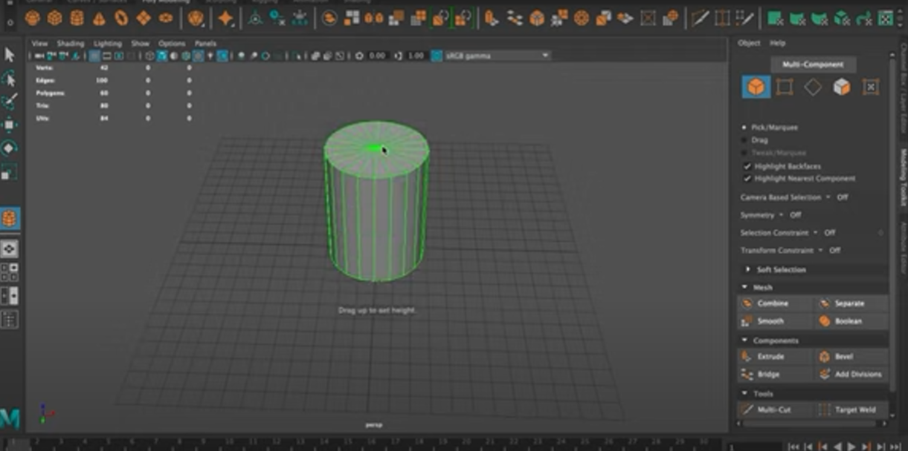
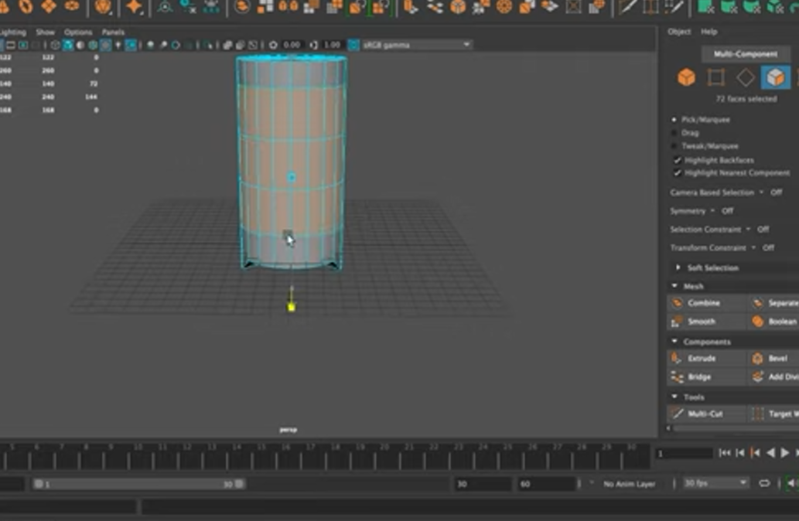
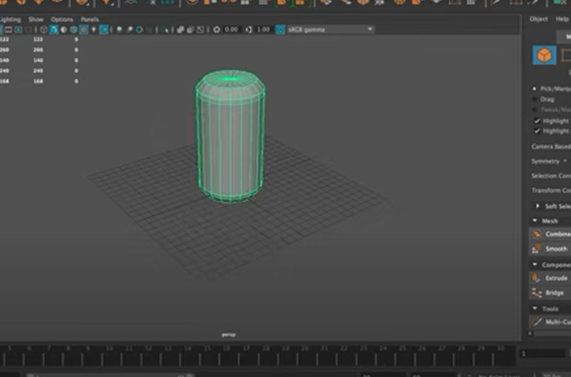
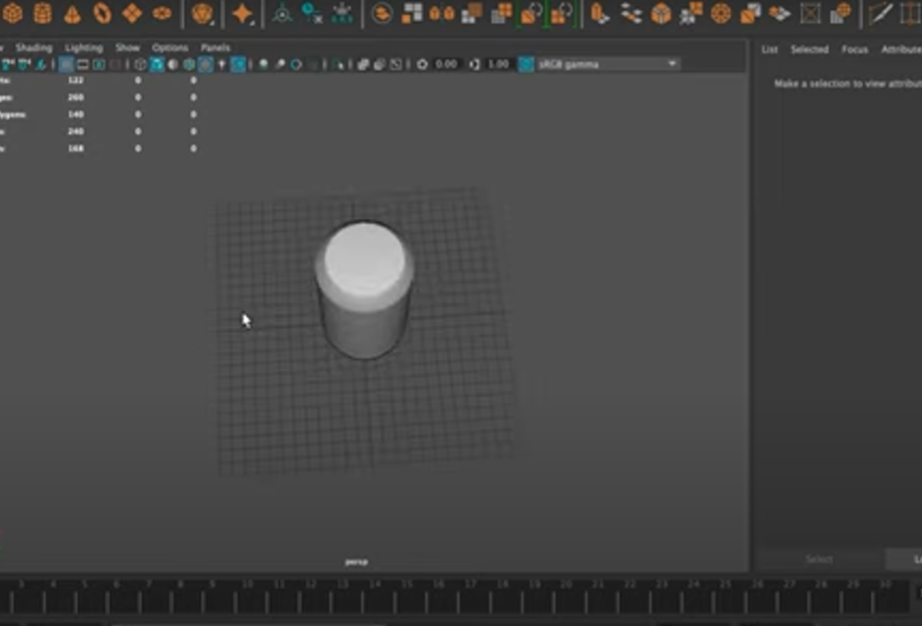
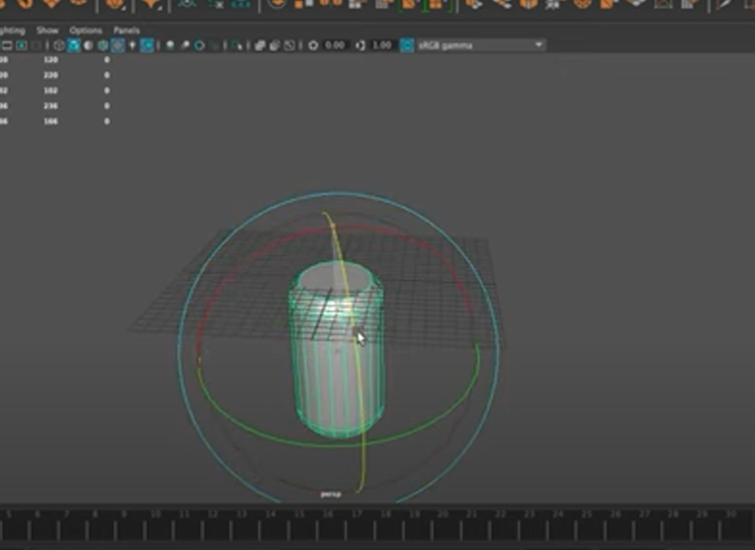

### Coke-Tin-Modelling:
```
Name:P.Siva Naga Nihin.
Reg.No:212221240037
```

### Aim:
To create a coke tin model using maya.


### Procedure:
Step1: Create a cylinder using polyshapes.

Step2: Extrude the cylinder till getting a proper shape of a can.

Step3: Adjust the sizes, division size and radius as per required.

Step4: Use modeling tool kit select face.

Step5: Select the middle faces.

Step6: Move those to one to the top and the other to the bottom.

Step7: Change the view of the scene to split view.


Step8: Select the top and bottom faces.

Step9: By using scale tool move those faces inwards so we get the shape of the tin.

Step10: Repeat the samething with scale tool in the bottom the can.

## Output:










## YouTube:
https://youtu.be/ILSfapEgS9Q


## Result:
Therefore a coke tin is successfully created using maya.
